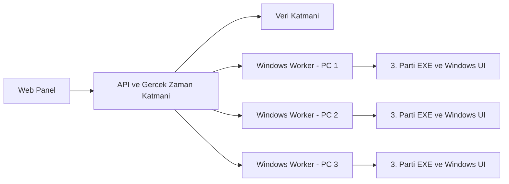
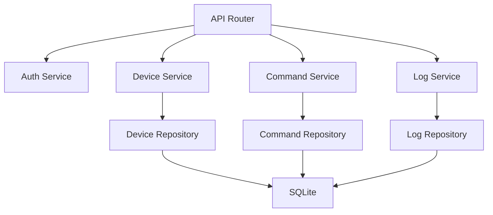
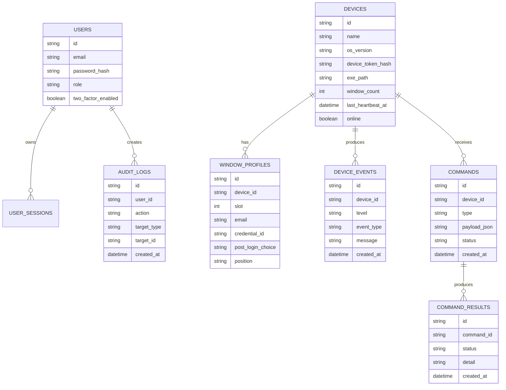

## 1. Mimari Tasarim
Bu sistem uc ana katmandan olusur: Mac ve mobil tarayicidan erisilen web panel, komut ve durum yonetimini saglayan backend, ve her Windows PC'de calisan yerel worker. Web panel dogrudan Windows UI ile etkilesmez; tum masaustu otomasyonu worker tarafinda gerceklesir.



## 2. Teknoloji Aciklamasi
- Frontend: React 18 + TypeScript + Vite + Tailwind CSS
- Baslatma Araci: Vite
- Backend: FastAPI + Python 3.12
- Gercek zaman iletisim: WebSocket tercihli, yedek olarak kisa aralikli polling
- Veritabani: SQLite ile MVP baslangici, sonrasinda PostgreSQL'e gecis imkani
- Worker: Python 3.12 + pywinauto + pywin32 + psutil + keyring
- Durum algilama: Once UI Automation, gerekli durumlarda OCR/goruntu eslesmesi yedek katman
- Pencere konumlandirma: Win32 API uzerinden MoveWindow / SetWindowPos
- Kimlik bilgisi saklama: Windows Credential Manager veya keyring

## 3. Rota Tanimlari
| Rota | Amac |
|------|------|
| /login | Yonetici girisi ve 2FA |
| /dashboard | Tum cihazlarin genel durumu ve toplu aksiyonlar |
| /devices | Cihaz listesi ve filtreleme |
| /devices/:deviceId | Cihaz detay, EXE ayari, profil yonetimi, manuel komutlar |
| /logs | Olay gecmisi ve hata kayitlari |
| /settings | Kullanici, rol, cihaz anahtari ve guvenlik ayarlari |

## 4. API Tanimlari
```ts
type DeviceStatus = {
  id: string;
  name: string;
  osVersion: string;
  online: boolean;
  internetReachable: boolean;
  lastHeartbeatAt: string;
  automationState: "idle" | "checking" | "relaunching" | "logging_in" | "positioning" | "error";
  lastError?: string;
};

type WindowProfile = {
  id: string;
  deviceId: string;
  slot: 1 | 2 | 3 | 4;
  email: string;
  credentialId: string;
  postLoginChoice?: string;
  position: "top_left" | "top_right" | "bottom_left" | "bottom_right";
};

type DeviceConfig = {
  deviceId: string;
  exePath: string;
  launchArgs?: string[];
  windowCount: number;
  healthCheckIntervalSec: number;
  reconnectCooldownSec: number;
  profiles: WindowProfile[];
};
```

### Ornek Uclar
| Metot | Uc | Amac |
|-------|----|------|
| POST | /api/auth/login | Panel girisi |
| POST | /api/auth/verify-2fa | Iki asamali dogrulama |
| GET | /api/devices | Cihaz listesi |
| GET | /api/devices/:id | Cihaz detayi |
| PUT | /api/devices/:id/config | Cihaz ayarlarini guncelle |
| POST | /api/devices/:id/commands/relogin | Tek cihaz icin relogin baslat |
| POST | /api/devices/:id/commands/reposition | Pencereleri yeniden hizala |
| POST | /api/devices/:id/commands/restart-all | Tum EXE oturumlarini sifirdan baslat |
| POST | /api/commands/bulk-relogin | Tum cihazlar icin toplu relogin |
| POST | /api/workers/heartbeat | Worker durum guncellemesi |
| POST | /api/workers/events | Worker olay ve log gonderimi |
| GET | /api/logs | Olay kayitlari |

## 5. Sunucu Mimari Diyagrami


## 6. Veri Modeli
### 6.1 Veri Modeli Tanimlari


### 6.2 Veri Tanimi Dili
```sql
CREATE TABLE users (
  id TEXT PRIMARY KEY,
  email TEXT NOT NULL UNIQUE,
  password_hash TEXT NOT NULL,
  role TEXT NOT NULL CHECK(role IN ('admin', 'viewer')),
  two_factor_enabled INTEGER NOT NULL DEFAULT 1
);

CREATE TABLE devices (
  id TEXT PRIMARY KEY,
  name TEXT NOT NULL,
  os_version TEXT NOT NULL,
  device_token_hash TEXT NOT NULL,
  exe_path TEXT,
  window_count INTEGER NOT NULL DEFAULT 4,
  last_heartbeat_at TEXT,
  online INTEGER NOT NULL DEFAULT 0
);

CREATE TABLE window_profiles (
  id TEXT PRIMARY KEY,
  device_id TEXT NOT NULL REFERENCES devices(id) ON DELETE CASCADE,
  slot INTEGER NOT NULL CHECK(slot BETWEEN 1 AND 4),
  email TEXT NOT NULL,
  credential_id TEXT NOT NULL,
  post_login_choice TEXT,
  position TEXT NOT NULL
);

CREATE TABLE commands (
  id TEXT PRIMARY KEY,
  device_id TEXT NOT NULL REFERENCES devices(id) ON DELETE CASCADE,
  type TEXT NOT NULL,
  payload_json TEXT,
  status TEXT NOT NULL,
  created_at TEXT NOT NULL
);

CREATE TABLE command_results (
  id TEXT PRIMARY KEY,
  command_id TEXT NOT NULL REFERENCES commands(id) ON DELETE CASCADE,
  status TEXT NOT NULL,
  detail TEXT,
  created_at TEXT NOT NULL
);

CREATE TABLE device_events (
  id TEXT PRIMARY KEY,
  device_id TEXT NOT NULL REFERENCES devices(id) ON DELETE CASCADE,
  level TEXT NOT NULL,
  event_type TEXT NOT NULL,
  message TEXT NOT NULL,
  created_at TEXT NOT NULL
);

CREATE INDEX idx_devices_heartbeat ON devices(last_heartbeat_at);
CREATE INDEX idx_window_profiles_device ON window_profiles(device_id);
CREATE INDEX idx_commands_device ON commands(device_id, created_at);
CREATE INDEX idx_device_events_device ON device_events(device_id, created_at);
```

## 7. Guvenlik ve Isletim Notlari
- Web panel zorunlu 2FA ile korunacak.
- Tum worker baglantilari cihaz bazli token ile yetkilendirilecek.
- Windows worker sadece disari dogru API'ye baglanacak; Windows makinelerde acik gelen komut portu olmayacak.
- Gercek sifreler backend veritabaninda tutulmayacak; cihaz uzerinde Credential Manager veya keyring ile saklanacak.
- Komutlar audit log ile izlenecek.
- Worker tarafinda otomasyon akisi state machine mantigi ile calisacak; sonsuz tiklama yerine durum dogrulama, retry ve cooldown kurallari olacak.
