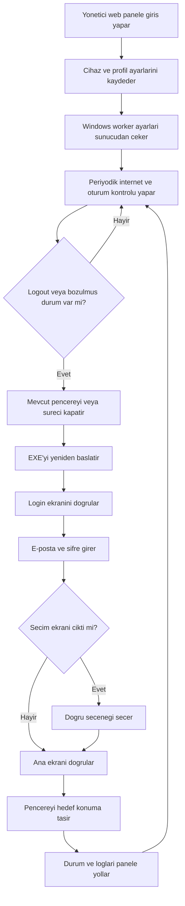

## 1. Urun Ozeti
Mac uzerinden yonetilen bir web panel ile, birden fazla Windows bilgisayarda calisan 3. parti EXE uygulamasinin otomatik olarak izlenmesi, yeniden acilmasi, login edilmesi ve 4 pencere duzeninin korunmasi hedeflenir.
- Ana amac, internet kesintisi veya oturum dusmesi gibi durumlarda kullanici bilgisayar basinda degilken bile surekliligi saglamak ve manuel uzak baglanti ihtiyacini azaltmaktir.
- Hedef deger, tek merkezden izleme, tek tusla komut gonderme ve otomatik toparlama saglayarak operasyon yukunu dusurmektir.

## 2. Cekirdek Ozellikler

### 2.1 Kullanici Rolleri
| Rol | Giris Yontemi | Temel Yetkiler |
|-----|---------------|----------------|
| Yonetici | E-posta + sifre + 2FA | Tum cihazlari gorme, komut gonderme, profil tanimlama, log izleme |
| Salt Izleyici | E-posta + sifre + 2FA | Cihaz durumlarini ve loglari goruntuleme |

### 2.2 Ozellik Modulleri
1. **Yonetim Paneli**: cihaz listesi, durum kartlari, anlik komutlar, hata ve saglik gorunumu
2. **Cihaz Detay Sayfasi**: cihaz bazli EXE yolu, pencere profilleri, login akisi, son eylemler
3. **Profil ve Gorev Tanimlari**: ayni e-posta/sifre ile iki pencere acilmasi, login sonrasi secim eslesmesi, pencere konum planlari
4. **Log ve Olay Takibi**: internet kesildi, logout algilandi, yeniden acildi, login basarili, hata ve retry kayitlari
5. **Windows Worker**: cihaz uzerindeki EXE'yi acma, kapatma, login olma, secim ekranlarini gecme, pencere konumlandirma, durumu raporlama

### 2.3 Sayfa Detaylari
| Sayfa Adi | Modul Adi | Ozellik Aciklamasi |
|-----------|-----------|--------------------|
| Giris | Kimlik dogrulama | Yonetici girisi, 2FA, oturum guvenligi |
| Panel | Cihaz ozetleri | 3 Windows PC'nin online/offline durumu, internet durumu, login durumu, son hata, son heartbeat |
| Panel | Toplu komutlar | Tek tusla tum cihazlarda relogin, yeniden baslat, pencere hizala |
| Cihaz Detay | EXE ayarlari | Her cihaza ozel EXE dosya yolu, pencere sayisi, baslangic parametreleri |
| Cihaz Detay | Pencere profilleri | Hangi pencere hangi hesapla acilir, login sonrasi hangi secim tiklanir, hedef ekran konumu |
| Cihaz Detay | Aksiyonlar | EXE'yi ac, tum pencereleri kapat, tekrar login yap, sadece hizalama calistir |
| Cihaz Detay | Saglik izlemesi | Internet kontrol sonucu, logout tespiti, islemde bekleme, son otomasyon asamasi |
| Loglar | Olay gecmisi | Komut gecmisi, worker yanitlari, hata detaylari, retry sayisi |
| Ayarlar | Yetki ve guvenlik | Kullanici yonetimi, cihaz anahtarlari, komut izinleri |

## 3. Temel Akis
Yonetici Mac uzerinden web panele girer ve her Windows cihazi icin EXE yolu, hesap profilleri ve pencere yerlesim kurallarini tanimlar. Windows worker bu ayarlari cekerek periyodik saglik kontrolu yapar. Internet geri geldiginde veya logout algilandiginda worker ilgili pencereyi ya da tum oturumu kontrollu bicimde kapatir, EXE'yi yeniden acar, login bilgilerini girer, gerekiyorsa iki secenekten dogru olani secer ve pencereyi hedef ceyrege tasir. Tum sonuc panelde loglanir ve gorsellestirilir.

## 4. Kullanim Arayuzu Tasarimi
### 4.1 Tasarim Stili
- Ana renkler: koyu antrasit arka plan, soguk mavi vurgu, kritik durumlar icin kehribar ve kirmizi tonlar
- Buton stili: hafif yuvarlatilmis, yuksek kontrastli, aksiyon onceligine gore renklenen kontroller
- Yazi stili: operator paneline uygun okunakli govde fontu, teknik veri kartlari icin monospaced yardimci metinler
- Yerlesim: desktop-first, yogun bilgi gosteren ama hiyerarsisi temiz kart tabanli panel
- Ikon stili: sade cizgisel ikonlar, durum renkleri ile desteklenmis semantik rozetler

### 4.2 Sayfa Tasarim Ozeti
| Sayfa Adi | Modul Adi | UI Ogesi |
|-----------|-----------|----------|
| Giris | Kimlik dogrulama | Koyu zemin, net form alani, 2FA adimi, oturum guvenlik uyari kartlari |
| Panel | Cihaz kartlari | Her cihaz icin durum rozetleri, heartbeat zamani, hizli aksiyon butonlari, hata etiketi |
| Panel | Toplu islem cubugu | Tum cihazlar icin tek tus aksiyonlari, guvenlik onayi, calisma ozetleri |
| Cihaz Detay | Profil editoru | Pencere bazli profil listesi, secim akisi editoru, konum onizleme semasi |
| Loglar | Olay akisi | Filtrelenebilir tablo, durum renkleri, zaman damgasi, hata detayi cekmecesi |

### 4.3 Duyarlilik
Arayuz desktop-first olarak tasarlanacak; Mac ve buyuk ekranli cihazlarda ana kullanim hedeflenecek. Tablet ve mobilde temel izleme ve kritik komutlar desteklenecek ancak detayli konfigurasyon desktopta optimize edilecektir.
